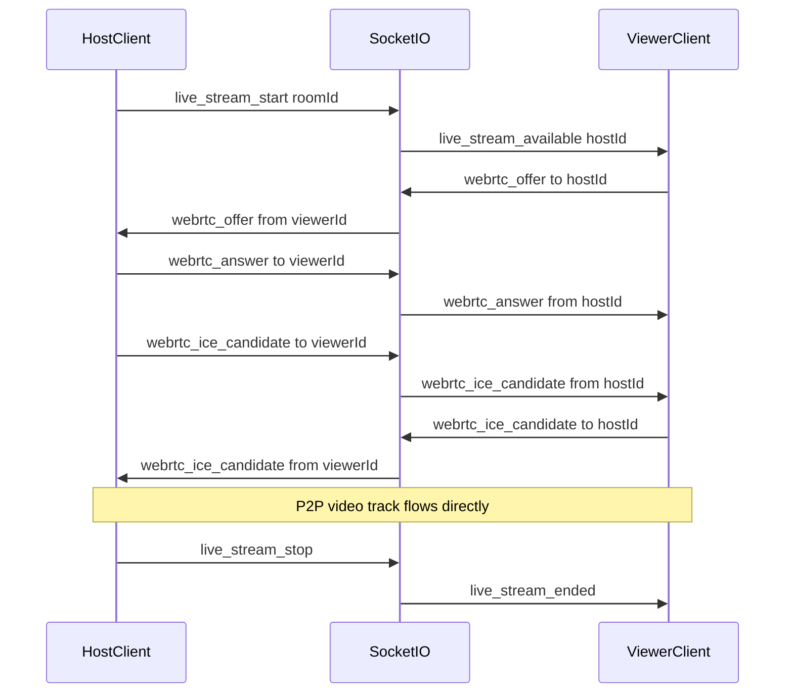

# Phase 2: Live Video Stream Design

This document outlines the planned architecture for **live camera / screen-share streaming** (video only, no audio) in Rave.

## Goals

- Host can broadcast a live video feed (camera or screen) to all room participants
- Coexist with the existing file-upload + HTTP sync watch-party flow
- No voice/audio call features

## Recommended stack

| Layer | Technology | Rationale |
|-------|------------|-----------|
| Signaling | Existing **Socket.IO** server | Already used for room/sync/chat; add `webrtc_offer`, `webrtc_answer`, `webrtc_ice_candidate` |
| Media (Flutter) | **flutter_webrtc** | Mature Flutter WebRTC bindings; supports camera + screen capture on Android |
| Media (future web) | **browser RTCPeerConnection** | Same signaling events from a web client |
| Multi-viewer scale | **mediasoup** or **LiveKit** SFU | Required if >2–3 viewers; 1:1 mesh is fine for MVP prototype |

## Signaling flow

## Backend events (stubbed)

Implemented as no-op stubs in [`backend/src/sockets/webrtcHandlers.js`](../backend/src/sockets/webrtcHandlers.js):

| Event | Direction | Payload |
|-------|-----------|---------|
| `live_stream_start` | client → server | `{ source: 'camera' \| 'screen' }` |
| `live_stream_stop` | client → server | — |
| `live_stream_available` | server → room | `{ hostId, source }` |
| `live_stream_ended` | server → room | `{ hostId }` |
| `webrtc_offer` | bidirectional via server | `{ toParticipantId, sdp }` |
| `webrtc_answer` | bidirectional via server | `{ toParticipantId, sdp }` |
| `webrtc_ice_candidate` | bidirectional via server | `{ toParticipantId, candidate }` |

Server validates: sender is room host for `live_stream_start`; all WebRTC events require both parties in the same room.

## Flutter implementation outline

1. Add `flutter_webrtc` dependency (Android first; iOS needs entitlements)
2. New feature module: `mobile/lib/features/live_stream/`
   - `live_stream_provider.dart` — host capture + peer connections
   - `live_stream_view.dart` — remote `RTCVideoView` overlay or replace file player
3. Host UI: toggle "Live stream" in `RoomScreen` app bar (camera / screen picker)
4. Viewers: auto-subscribe on `live_stream_available`; tear down on `live_stream_ended`
5. **No audio**: `getUserMedia` / `getDisplayMedia` with `audio: false`

## MVP vs production

| Approach | Pros | Cons | When to use |
|----------|------|------|-------------|
| Mesh (host ↔ each viewer) | No extra infra | Host upload bandwidth scales with N | ≤3 viewers, prototype |
| SFU (mediasoup/LiveKit) | Scales to many viewers | Extra service to deploy | Production |

## Manual E2E checklist (two devices)

Use after implementing Phase 2 client code:

1. Device A: create room, start live stream (camera)
2. Device B: join room, confirm video renders within 5s
3. Device A: stop stream → Device B shows "stream ended"
4. Repeat with screen share
5. Confirm file-upload playback still works when live stream is inactive

## Current status

- **Signaling**: implemented in [`backend/src/sockets/webrtcHandlers.js`](../backend/src/sockets/webrtcHandlers.js)
- **Room live stream state**: persisted on room, included in `room_state` on join
- **Flutter WebRTC client**: implemented in [`mobile/lib/features/live_stream/`](../mobile/lib/features/live_stream/)
- **SFU**: not started (mesh P2P for MVP)
